# Omarchy Killer Klownz Theme

Deep-space black, alien cyan, clown-pink sugar, and slime-green instruments all shoved into the same desktop on purpose. This theme treats the terminal as the cold void, then lets Walker, notifications, Discord, and Hyprland decoration break the rules in loud, different ways.

## Preview

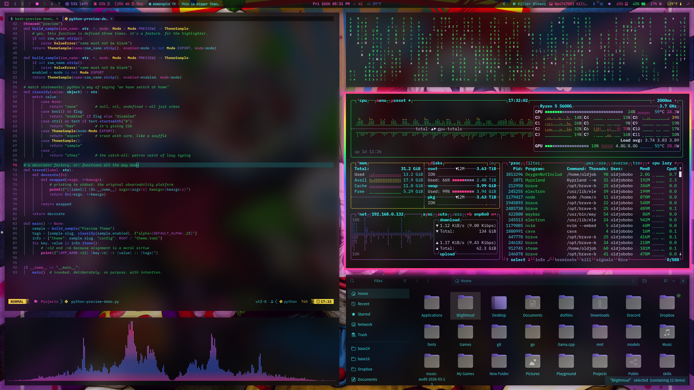

## Install

Use the Omarchy theme installer:

```bash
omarchy-theme-install https://github.com/OldJobobo/omarchy-killer-klownz-theme
```

## What's Included

- A spinning multicolor Hyprland border treatment with magenta shadow glow and sharp-cornered tiled windows
- A cotton-candy Walker launcher that intentionally flips the usual dark-theme expectation
- Inverted cream notifications and a matching `swaync` popup treatment
- Slime-green SwayOSD surfaces that feel like a separate alien instrument panel
- A custom Vencord theme with pink channel sidebar, green server rail, and black chat surface

## Wallpapers

<table>
  <tr>
    <td>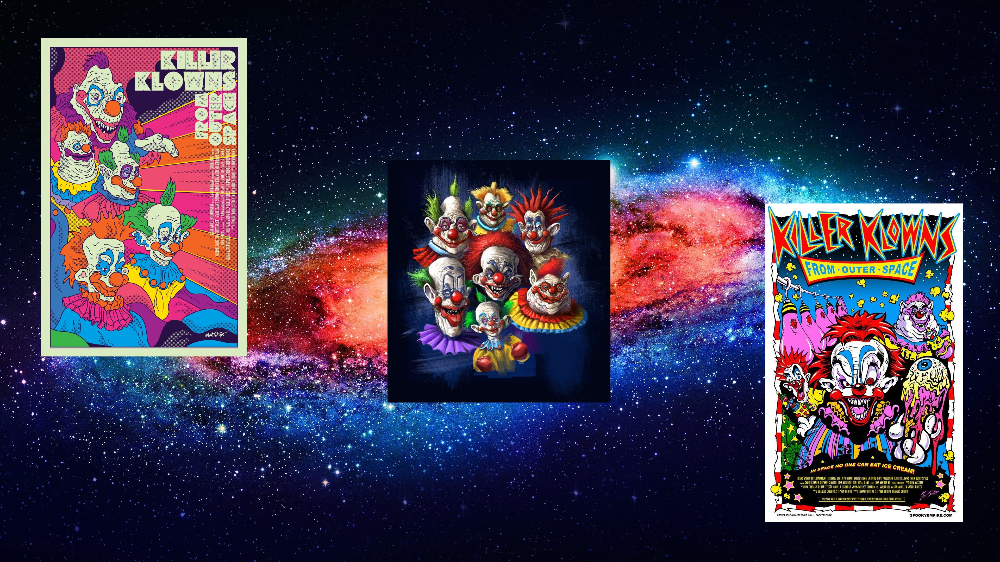</td>
    <td>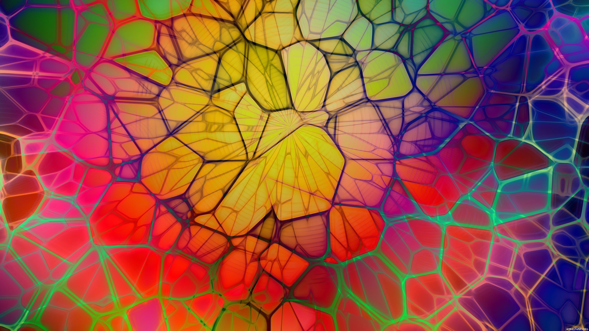</td>
    <td>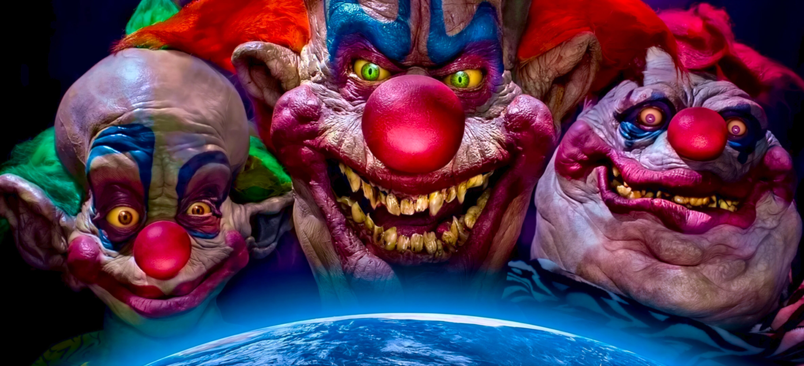</td>
  </tr>
  <tr>
    <td>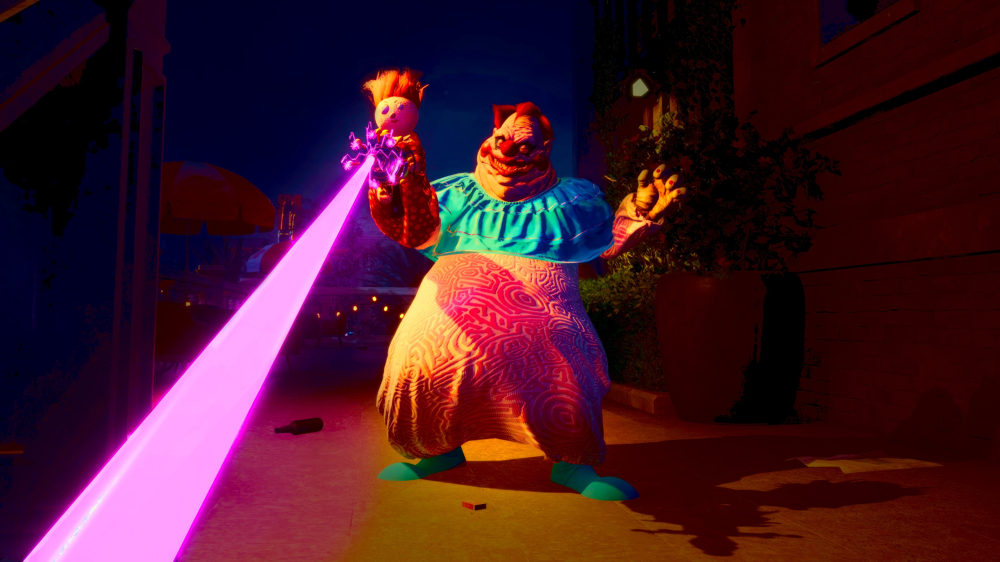</td>
    <td>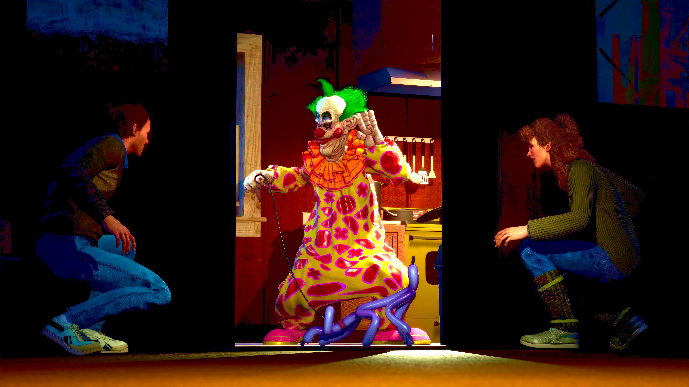</td>
    <td>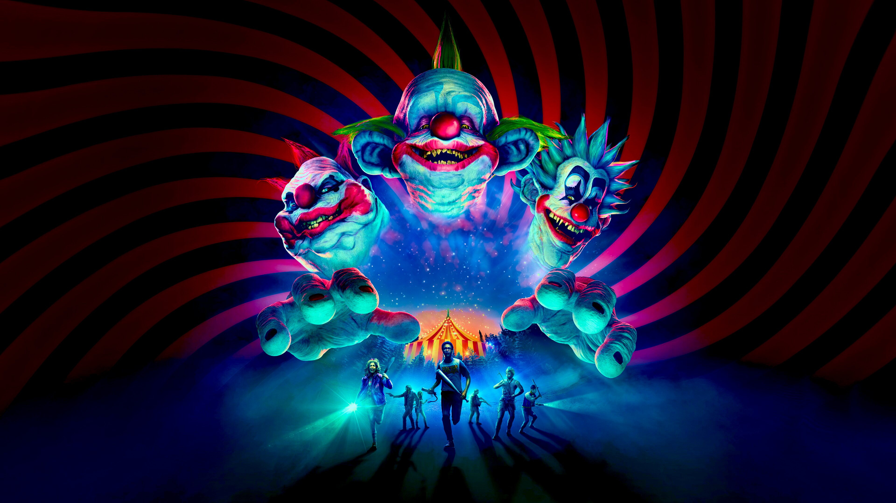</td>
  </tr>
  <tr>
    <td>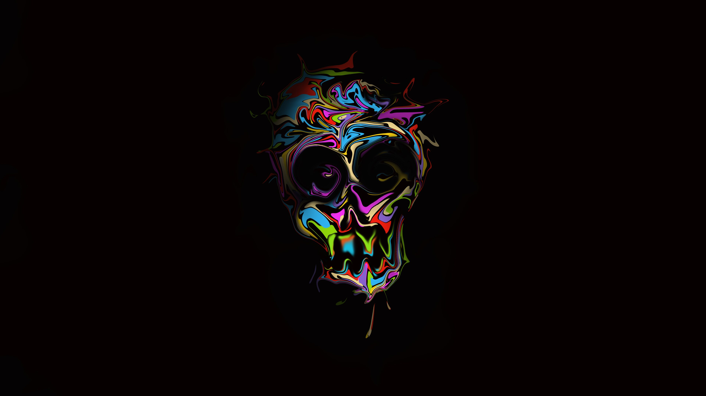</td>
    <td>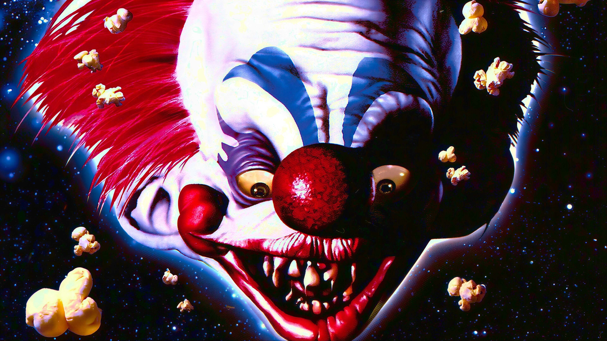</td>
    <td>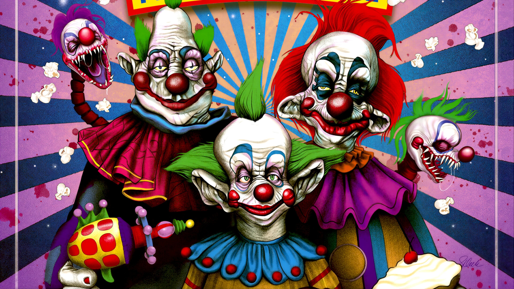</td>
  </tr>
  <tr>
    <td>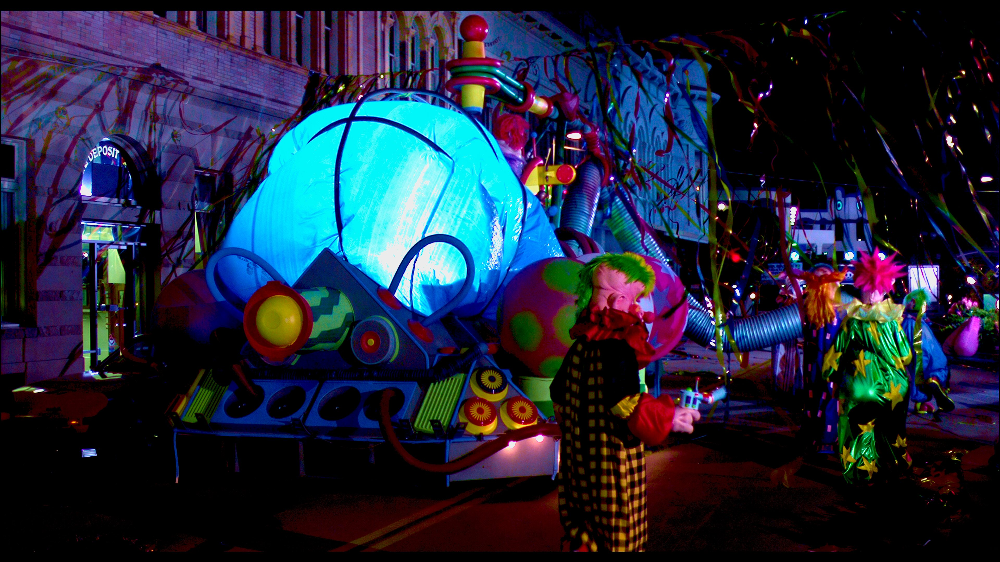</td>
    <td>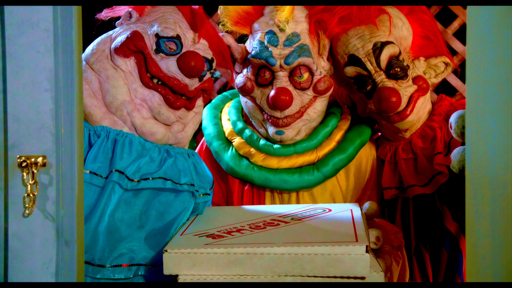</td>
    <td></td>
  </tr>
</table>

## Requirements

- `Yaru-purple` icon theme

## Notes

- This theme is intentionally not color-uniform. Walker stays pink, notifications stay cream, SwayOSD stays green, and the terminal stays in the void.

## Attribution

- Inspired by *Killer Klowns from Outer Space* and its game adaptation
- Wallpapers in `backgrounds/` are included as collected source images from the theme's visual reference set
